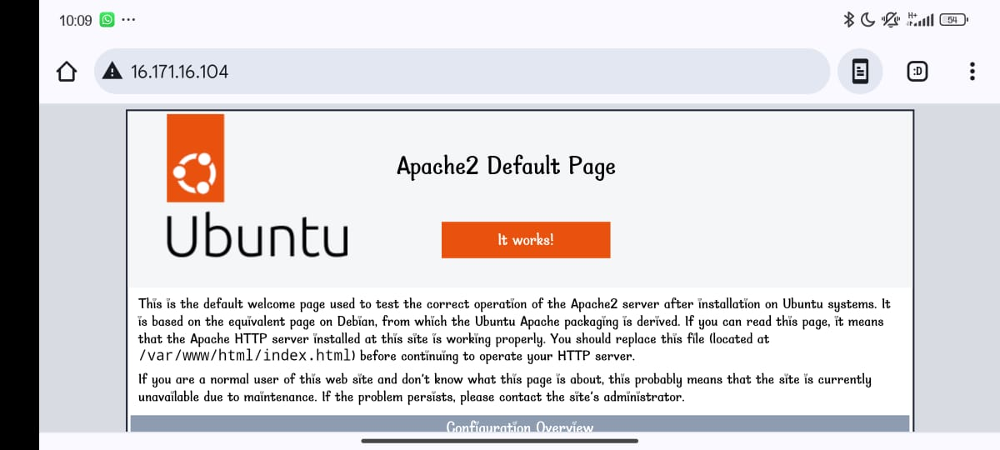

## WEB STACK IMPLEMENTATION (LAMP STACK) IN AWS

### Introduction:

__The LAMP stack is a widely used open-source platform for web development, comprising four core components: Linux, Apache, MySQL, and PHP (or occasionally Perl or Python). This guide provides an overview of its setup, configuration, and usage.__

## Step 0: Prerequisites

__1.__ EC2 Instance of t2.micro type and Ubuntu 24.04 LTS (HVM) was lunched in the us-east-1 region using the AWS console.


__2.__ Created SSH key pair named __henrylearndevops__ to access the instance on port 22


__3.__ The security group was configured with the following inbound rules:

- Allow traffic on port 80 (HTTP) with source from anywhere on the internet.
- Allow traffic on port 443 (HTTPS) with source from anywhere on the internet.
- Allow traffic on port 22 (SSH) with source from any IP address. This is opened by default.


__4.__ The default VPC and Subnet was used for the networking configuration.


__6.__  I used MobaXterm on my Windows PC to locate the downloaded private SSH key and connect directly to the EC2 instance
Where __username=ubuntu__ and __remotehost=16.171.16.104.__


## Step 1 - Install Apache and Update the Firewall

__1.__ __Update list of packages in package manager__
```
sudo apt update
```
__2.__ __Run apache2 package installation__
```
sudo apt install apache2
```

__3.__ __Enable and verify that apache is running on as a service on the OS.__
```
sudo systemctl enable apache2
sudo systemctl status apache2
```
If it green and running, then apache2 is correctly installed


__4.__ __The server is running and can be accessed locally in the ubuntu shell by running the command below:__

```
curl http://localhost:80
OR
curl http://127.0.0.1:80
```


__5.__ __Test with the public IP address if the Apache HTTP server can respond to request from the internet using the url on a browser.__
```
http://16.171.16.10:80
```

This shows that the web server is correctly installed and it is accessible throuhg the firewall.


## Step 2 - Install MySQL

__1.__ __Install a relational database (RDB)__

MySQL was installed in this project. It is a popular relational database management system used within PHP environments.
```
sudo apt install mysql-server
```
When prompted, install was confirmed by typing y and then Enter.

__2.__ __Enable and verify that mysql is running with the commands below__
```
sudo systemctl enable --now mysql
sudo systemctl status mysql
```

__3.__ __Log in to mysql console__
```
sudo mysql 
```
This connects to the MySQL server as the administrative database user __root__ infered by the use of __sudo__ when running the command.

__4.__ __Set a password for root user using mysql_native_password as default authentication method.__

Here, the user's password was defined as "Password.1"
```
ALTER USER 'root'@'localhost' IDENTIFIED WITH mysql_native_password BY 'Password.1';
```
Exit the MySQL shell
```
exit
```

__5.__ __Run an Interactive script to secure MySQL__

The security script comes pre-installed with mysql. This script removes some insecure settings and lock down access to the database system.
```
sudo mysql_secure_installation
```


__6.__ __After changing root user password, log in to MySQL console.__

A command prompt for password was noticed after running the command below.
```
mysql -u root -p
```

Exit MySQL shell
```
exit
```

## Step 3 - Install PHP

__1.__ __Install php__
Apache is installed to serve the content and MySQL is installed to store and manage data.
PHP is the component of the set up that processes code to display dynamic content to the end user.

The following were installed:
- php package
- php-mysql, a PHP module that allows PHP to communicate with MySQL-based databases.
- libapache2-mod-php, to enable Apache to handle PHP files.
```
sudo apt install php libapache2-mod-php php-mysql
```

Confirm the PHP version
```
php -v
```

At this stage, the LAMP stack is fully installed and functioning. To test the setup using a PHP script, it's recommended to configure an Apache Virtual Host to manage the website files and directories. A virtual host allows multiple websites to be hosted on a single server without the users noticing.

## Step 4 - Create a virtual host for the website using Apache

__1.__ __The default directory serving the apache default page is /var/www/html. Create your document directory next to the default one.__

Created the directory for projectlamp using "mkdir" command
```
sudo mkdir /var/www/projectlamp
```

__Assign the directory ownership with $USER environment variable which references the current system user.__
```
sudo chown -R $USER:$USER /var/www/projectlamp
```

__2.__ __Create and open a new configuration file in apache’s “sites-available” directory using vim.__
```
sudo vim /etc/apache2/sites-available/projectlamp.conf
```

Past in the bare-bones configuration below:
```
<VirtualHost *:80>
  ServerName projectlamp
  ServerAlias www.projectlamp
  ServerAdmin webmaster@localhost
  DocumentRoot /var/www/projectlamp
  ErrorLog ${APACHE_LOG_DIR}/error.log
  CustomLog ${APACHE_LOG_DIR}/access.log combined
</VirtualHost>
```


__3.__ __Show the new file in sites-available__
```
sudo ls /etc/apache2/sites-available
```
```
Output:
000-default.conf default-ssl.conf projectlamp.conf
```


With the VirtualHost configuration, Apache will serve projectlamp using /var/www/projectlamp as its web root directory.

__4.__ __Enable the new virtual host__
```
sudo a2ensite projectlamp
```

__5.__ __Disable apache’s default website.__

This is because Apache’s default configuration will overwrite the virtual host if not disabled. This is required if a custom domain is not being used.
```
sudo a2dissite 000-default
```

__6.__ __Ensure the configuration does not contain syntax error__

The command below was used:
```
sudo apache2ctl configtest
```


__7.__ __Reload apache for changes to take effect.__
```
sudo systemctl reload apache2
```


__8.__ __The new website is now active but the web root /var/www/projectlamp is still empty. Create an index.html file in this location so to test the virtual host work as expected.__
```
sudo echo 'Hello LAMP from hostname' $(curl -s http://169.254.169.254/latest/meta-data/public-hostname) 'with public IP' $(curl -s http://169.254.169.254/latest/meta-data/public-ipv4) > /var/www/projectlamp/index.html
```

__9.__ __Open the website on a browser using the public IP address.__
```
http://16.171.16.1043:80
```


This file can serve as a temporary landing page for the application until it is replaced by an index.php file. Once the index.php file is set up, the index.html file should either be renamed or removed from the document root, as it will take precedence over the index.php file by default.

## Step 5 - Enable PHP on the website


By default, Apache's DirectoryIndex setting gives priority to the index.html file over the index.php file. This can be useful when setting up a maintenance page for PHP applications. You can create a temporary index.html file with a message for visitors, making it the default landing page during maintenance. Once maintenance is complete, you can rename or remove the index.html file from the document root, allowing the regular application page to be displayed again.

To change this behavior, you can edit the /etc/apache2/mods-enabled/dir.conf file and adjust the order in which the index.php file is listed in the DirectoryIndex directive.

__1.__ __Open the dir.conf file with vim to change the behaviour__
```
sudo vim /etc/apache2/mods-enabled/dir.conf
```

```
<IfModule mod_dir.c>
  # Change this:
  # DirectoryIndex index.html index.cgi index.pl index.php index.xhtml index.htm
  # To this:
  DirectoryIndex index.php index.html index.cgi index.pl index.xhtml index.htm
</IfModule>
```


__2.__ __Reload Apache__

Apache is reloaded so the changes takes effect.
```
sudo systemctl reload apache2
```

__3.__ __Create a php test script to confirm that Apache is able to handle and process requests for PHP files.__

A new index.php file was created inside the custom web root folder.

```
vim /var/www/projectlamp/index.php
```

__Add the text below in the index.php file__
```
<?php
phpinfo();
```


__4.__ __Now refresh the page__


This page displays server information from PHP's perspective, which is helpful for debugging and verifying that the settings are applied correctly.

After reviewing the server details on this page, it's advisable to delete the file, as it contains sensitive information about the PHP environment and the Ubuntu server. The file can be recreated later if needed.

```
sudo rm /var/www/projectlamp/index.php
```


__Conclusion:__

The LAMP stack offers a powerful and versatile platform for developing and deploying web applications. By following the instructions in this documentation, you can successfully set up, configure, and manage a LAMP environment, allowing for the creation of robust and scalable web solutions.


